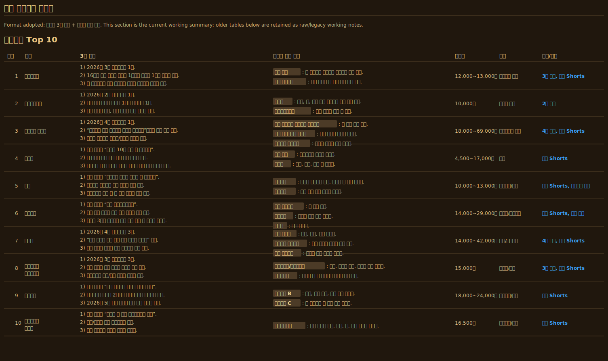

# foodie-radar

A Markdown-based restaurant intelligence system for tracking trusted food creators, official guide lists, recommendation signals, sponsorship risk, and personal taste fit.

This is not a generic “find me a restaurant nearby” prompt. It is designed to answer questions like:

- Who directly recommended this restaurant?
- Is it listed by Michelin, Bib Gourmand, or Blue Ribbon?
- Is the recommendation sponsored, invited, gifted, or campaign-linked?
- Does the creator’s taste match mine?
- Does the recommendation contain strong signals such as “best in category”, “national No. 1”, “life-changing favorite”, “regular spot”, or “craft-level quality”?
- Are the menu, price, location, and operational details concrete enough to make it a real visit candidate?

## Core Idea

`foodie-radar` separates restaurant recommendations into several auditable layers.

1. Official guide layer
   - Michelin starred/selected restaurants
   - Bib Gourmand
   - Blue Ribbon

2. Food creator and influencer layer
   - Tracks trusted YouTube, Instagram, blog, newsletter, and map/list sources.
   - Evaluates recommendation quality, sponsorship risk, and personal taste fit.

3. Restaurant ledger layer
   - Normalizes restaurant names, branches, aliases, location, category, menu, price, and source links.

4. Personal taste layer
   - Stores what kind of recommendations you actually value.
   - Examples: best in category, extreme value with real quality, craft-driven restaurants, personal favorites, repeat-visit spots.

5. Visit queue
   - Separates immediate candidates, holds, stale entries, and restaurants that need operational verification.

## Why This Exists

Generic search is shallow. Blog ads, map ratings, and viral posts rarely explain why a restaurant is actually worth visiting.

Following a few trusted food creators manually is also hard. Video titles can be clickbait. Shorts may hide the restaurant name. Instagram captions, YouTube descriptions, or hashtags may contain the actual restaurant data.

This project manages restaurant discovery by:

- Maintaining a trusted food creator registry.
- Tracking each creator’s restaurant recommendations.
- Labeling sponsorship and advertising risk.
- Separating creators with similar taste from creators with more advanced or higher-end taste.
- Writing three practical recommendation lines for every restaurant.
- Adding menu-level reasons instead of vague praise.
- Requiring course or omakase restaurants to include major course items and dish-level details when available.

## Standard Recommendation Format

```markdown
Last checked: YYYY-MM-DD
Scope/condition:
Note: Always re-check hours, holidays, reservations, and operating status before visiting.

## Top N by Budget/Condition

| Rank | Restaurant | 3-Line Recommendation | Menu-Level Reasons | Price | Location | Source/Notes |
|---:|---|---|---|---|---|---|
| 1 | Restaurant name | 1) Strong recommendation signal. <br>2) Why it fits the user’s taste. <br>3) When or why to visit. | `Menu A`: Why it is the representative order. <br>`Menu B`: What it helps verify. |  |  |  |
```

Rules:

- Every listed restaurant needs at least three practical recommendation lines.
- “Good”, “famous”, or “good value” is not enough.
- Every major menu item needs a menu-level reason.
- Course meals and omakase require major course items and dish-level features when available.
- Separate creator evidence from assistant analysis.

## Sample: Jaesullang Three-Month Price-Tier List

Jaesullang Guide is used here as a sample creator because it is one of the personally trusted food YouTube channels in this workflow.

Example request:

```text
Summarize Jaesullang's restaurant recommendations from the last three months by price tier.
Create Top 10 lists for all prices, under 100,000 KRW, under 50,000 KRW, and under 30,000 KRW.
For each restaurant, include a three-line recommendation, menu-level reasons, price range, location, and sources.
```

Instead of returning a plain list of titles, `foodie-radar` organizes the result by:

- Monthly ranking placement, repeat mentions, and strong title signals.
- Restaurant names, prices, locations, and menus extracted from descriptions and hashtags.
- At least three practical recommendation lines per restaurant.
- Menu-level reasons for the main order candidates.
- Course or omakase details, with uncertain entries held or downgraded when course details are missing.

The image below is a sample price-tier table for Jaesullang's recent three-month recommendations.



## Food Creator and Influencer List

The current `creator-source-pool.md` starts with a first-pass list of food creators and influencers ranked roughly by public YouTube subscriber counts.

This is not meant to be an absolute trust ranking. It is a starting point.

Users can edit the creator pool based on their own taste.

- First-tier creators to track immediately.
- Secondary creators for cross-checking.
- Creators to hold due to sponsorship or advertising risk.
- Creators to remove because they focus on alcohol, convenience stores, franchises, or categories outside the user's taste.
- Fine-dining or omakase creators to keep as future wishlist or learning sources.

The preferred creators are those who either share the user's taste or have a more advanced/high-end dining perspective.

Strong signals include personal favorites, regular spots, best-in-category claims, national No. 1 claims, and recommendations that clearly explain why a restaurant is worth visiting.

So the creator list in `foodie-radar` is not a fixed answer. It is an editable radar tuned to each user's taste.

## YouTube Shorts Handling

Some food creators, especially Shorts-heavy channels, often omit restaurant names from titles.

For example, a title like “Is this expensive gomtang worth it?” may only reveal the actual restaurant name in the description or hashtags.

For Shorts, always inspect:

- Title
- Description
- Hashtags
- Upload date
- Auto captions or visible text when available
- Restaurant aliases and branch names

## Repository Structure

```text
.
├─ README.md
├─ README.en.md
├─ skills/
│  └─ restaurant-trust-intelligence/
│     └─ SKILL.md
└─ restaurant-intelligence/
   ├─ official-guides.md
   ├─ creator-registry.md
   ├─ creator-lifecycle.md
   ├─ creator-source-pool.md
   ├─ restaurant-ledger.md
   ├─ taste-profile.md
   ├─ recommendation-queue.md
   ├─ category-analysis.md
   ├─ source-watchlist.md
   ├─ trust-rubric.md
   └─ daily-update-log.md
```

## Usage

1. Use this repository as an Obsidian vault or a GitHub-backed Markdown knowledge base.
2. Update the files under `restaurant-intelligence/` daily or periodically.
3. Register `skills/restaurant-trust-intelligence/SKILL.md` as a Codex skill or adapt it for another AI workflow.
4. Ask for restaurant recommendations with source evidence, trust level, sponsorship risk, taste fit, and menu-level reasoning.

## License

MIT
